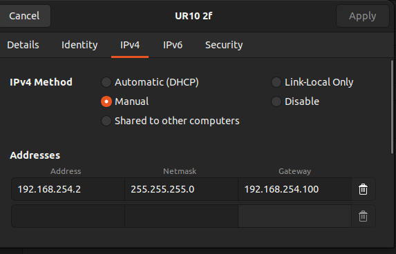

### drims2_cells

This repository contains the robot descriptions, MoveIt configurations, and controller settings for the UR10e, and PAL Tiago Pro robots used in the DRIMS2 Summer School 2025.

To launch the robotic cells, use the following commands.

For the UR10e with hand-e gripper robot:

```bash
ros2 launch drims2_description ur10e_start.launch.py fake:=true
```

For the UR10e with 2f gripper robot:

```bash
ros2 launch drims2_description ur10e_2f_start.launch.py fake:=true
```

<!-- For the ABB YuMi robot:
```bash
ros2 launch drims2_description yumi_start.launch.py fake:=true
``` -->

For the Tiago Pro robot:
```bash
ros2 launch drims2_description tiago_pro_start.launch.py fake:=true
```

> ⚠️  Use `fake:=true` to run in simulation mode, and `fake:=false` to connect to the real hardware.

## How to connect to robot

### UR robot

To connect to the UR robot, first plug the **Ethernet cable** from the robot to your laptop.  

1. On Ubuntu, go to **Settings → Network → Wired → Add**.  
2. Create a new wired network with the configuration shown in the image below:  




To verify that the connection is working, open a terminal and run:

```bash
ping 192.164.254.100
```

If the network is correctly configured, you should see replies from the robot as shown below:


### Tiago Pro

1. **Network setup**  
   - Connect your laptop to the robot using a **wired DHCP connection**.  

2. **Start the Docker environment**  
   - Once inside the container, run:  
     ```bash
     source setup_robot_connection.sh
     ```
   - Ensure that all messages are displayed without errors.

3. **Verification**  
   - Check that the topics from Tiago are visible:  
     ```bash
     ros2 topic list
     ```
   - When opening new terminals, use:  
     ```bash
     ./connect.sh
     ```
     and verify that the same topics are still visible.

